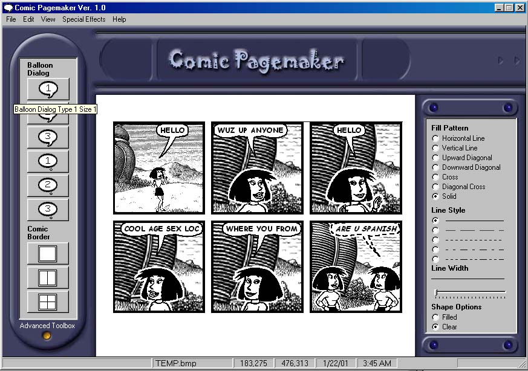



## Comic Pagemaker \(Updated\)

### Description

This is a comic editorial program that demonstrates on how to create balloon dialog layouts including borders and you have the options of importing more pictures like cartoons etc. Have fun with it and don't forget to vote for it.
 
### More Info
 
Please register the EZTW32.DLL inside the "C:\WINDOWS\SYSTEM" directory and insert it after that go to run and then type "REGSVR32 EZTW32.DLL"

             |
---                |---
**Submitted On**   |2001-01-22 04:14:18
**By**             |[Walter Narvasa](https://github.com/Planet-Source-Code/PSCIndex/blob/master/ByAuthor/walter-narvasa.md)
**Level**          |Advanced
**User Rating**    |4.0 (72 globes from 18 users)
**Compatibility**  |VB 6\.0
**Category**       |[Graphics](https://github.com/Planet-Source-Code/PSCIndex/blob/master/ByCategory/graphics__1-46.md)
**World**          |[Visual Basic](https://github.com/Planet-Source-Code/PSCIndex/blob/master/ByWorld/visual-basic.md)
**Archive File**   |[CODE\_UPLOAD140911232001\.zip](https://github.com/Planet-Source-Code/walter-narvasa-comic-pagemaker-updated__1-14653/archive/master.zip)

